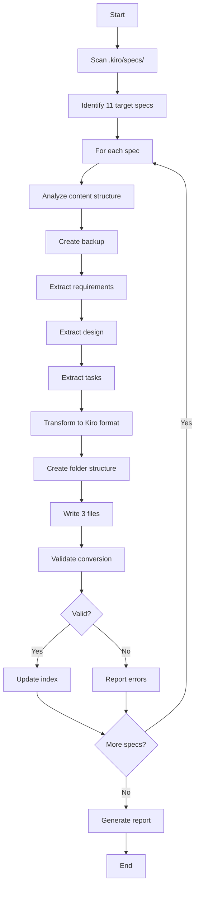

# Design Document

## Overview

This design describes a system for converting 11 existing Angular migration specification files from simple Markdown format to Kiro's folder-based structure (requirements.md, design.md, tasks.md). The conversion system will analyze existing content, intelligently categorize it, create proper folder structures, and preserve all original information while making specs compatible with Kiro's interface.

The system follows a pipeline architecture: Analyze → Backup → Extract → Transform → Validate → Update Index.

## Architecture

### High-Level Architecture

```
┌─────────────────────────────────────────────────────────────────┐
│                     Spec Conversion System                      │
├─────────────────────────────────────────────────────────────────┤
│                                                                 │
│  ┌──────────────┐      ┌──────────────┐      ┌──────────────┐  │
│  │   Analyzer   │ ───> │   Backup     │ ───> │  Extractor   │  │
│  │              │      │   System     │      │              │  │
│  └──────────────┘      └──────────────┘      └──────────────┘  │
│         │                                            │          │
│         │                                            │          │
│         v                                            v          │
│  ┌──────────────┐      ┌──────────────┐      ┌──────────────┐  │
│  │  Structure   │ <─── │ Transformer  │ <─── │  Validator   │  │
│  │   Builder    │      │              │      │              │  │
│  └──────────────┘      └──────────────┘      └──────────────┘  │
│         │                                                       │
│         v                                                       │
│  ┌──────────────┐                                              │
│  │    Index     │                                              │
│  │   Updater    │                                              │
│  └──────────────┘                                              │
│                                                                 │
└─────────────────────────────────────────────────────────────────┘
```

### Component Responsibilities

1. **Analyzer**: Scans existing specs, identifies structure and content types
2. **Backup System**: Creates timestamped backups of original files
3. **Extractor**: Pulls out requirements, design, and task content
4. **Transformer**: Formats content according to Kiro templates
5. **Validator**: Verifies conversion correctness and completeness
6. **Structure Builder**: Creates folder structure and files
7. **Index Updater**: Updates _index.json and metadata

### Processing Pipeline



## Components and Interfaces

### 1. Analyzer Component

**Purpose**: Scan and analyze existing spec files to understand their structure.

**Interface**:
```typescript
interface Analyzer {
  scanSpecsDirectory(): SpecFile[];
  analyzeSpec(file: SpecFile): SpecAnalysis;
  identifyContentTypes(content: string): ContentTypeMap;
}

interface SpecFile {
  path: string;
  name: string;
  content: string;
  size: number;
}

interface SpecAnalysis {
  fileName: string;
  sections: Section[];
  hasRequirements: boolean;
  hasDesign: boolean;
  hasTasks: boolean;
  contentTypes: ContentTypeMap;
}

interface Section {
  title: string;
  level: number;
  content: string;
  type: 'requirement' | 'design' | 'task' | 'mixed' | 'unknown';
}

interface ContentTypeMap {
  requirements: string[];
  design: string[];
  tasks: string[];
  mixed: string[];
}
```

**Algorithm**:
1. Read all `.md` files from `.kiro/specs/` (excluding subdirectories)
2. Parse Markdown structure (headers, sections)
3. Classify each section by keywords:
   - Requirements: "objectif", "user story", "acceptance", "exigence", "besoin"
   - Design: "architecture", "implementation", "approach", "technical", "component"
   - Tasks: "step", "checklist", "procedure", "étape", "action"
4. Return analysis with confidence scores

### 2. Backup System Component

**Purpose**: Create safe backups of original files before conversion.

**Interface**:
```typescript
interface BackupSystem {
  createBackup(file: SpecFile): BackupResult;
  getBackupPath(fileName: string): string;
  verifyBackup(original: string, backup: string): boolean;
}

interface BackupResult {
  success: boolean;
  backupPath: string;
  timestamp: string;
  originalHash: string;
  backupHash: string;
}
```

**Implementation**:
- Backup location: `.kiro/specs/backup/YYYY-MM-DD/`
- Naming: `{original-name}-{timestamp}.md`
- Manifest: `.kiro/specs/backup/manifest.json`
- Verification: SHA-256 hash comparison

### 3. Content Extractor Component

**Purpose**: Extract and categorize content from analyzed specs.

**Interface**:
```typescript
interface ContentExtractor {
  extractRequirements(analysis: SpecAnalysis): RequirementsContent;
  extractDesign(analysis: SpecAnalysis): DesignContent;
  extractTasks(analysis: SpecAnalysis): TasksContent;
}

interface RequirementsContent {
  introduction: string;
  glossary: GlossaryTerm[];
  requirements: Requirement[];
}

interface Requirement {
  id: number;
  userStory: string;
  acceptanceCriteria: string[];
}

interface DesignContent {
  overview: string;
  architecture: string;
  components: ComponentDescription[];
  dataModels: string;
  errorHandling: string;
}

interface TasksContent {
  overview: string;
  tasks: Task[];
}

interface Task {
  id: string;
  description: string;
  subTasks: SubTask[];
  requirements: string[];
}

interface SubTask {
  id: string;
  description: string;
  optional: boolean;
}
```

**Extraction Rules**:

**For Requirements**:
- Extract objectives → Introduction
- Extract key terms → Glossary
- Extract user needs → User Stories
- Extract validation criteria → Acceptance Criteria
- Convert to EARS patterns where possible

**For Design**:
- Extract architecture diagrams → Architecture section
- Extract technical approaches → Components section
- Extract data structures → Data Models section
- Extract error scenarios → Error Handling section

**For Tasks**:
- Extract step-by-step procedures → Numbered tasks
- Extract checklists → Sub-tasks
- Extract validation steps → Checkpoint tasks
- Mark tests as optional with `*`

### 4. Content Transformer Component

**Purpose**: Format extracted content according to Kiro templates.

**Interface**:
```typescript
interface ContentTransformer {
  transformRequirements(content: RequirementsContent): string;
  transformDesign(content: DesignContent): string;
  transformTasks(content: TasksContent): string;
  applyTemplate(content: any, template: string): string;
}
```

**Templates**:
- Requirements template: EARS patterns, glossary, user stories
- Design template: Overview, architecture, components, properties, testing
- Tasks template: Numbered tasks with sub-tasks and checkpoints

**Transformation Rules**:
1. Preserve all original content
2. Add proper Markdown formatting
3. Include front-matter metadata
4. Add section headers per template
5. Format code blocks and tables
6. Preserve links and references

### 5. Structure Builder Component

**Purpose**: Create Kiro folder structure and write files.

**Interface**:
```typescript
interface StructureBuilder {
  createSpecFolder(specName: string): string;
  writeRequirements(folderPath: string, content: string): void;
  writeDesign(folderPath: string, content: string): void;
  writeTasks(folderPath: string, content: string): void;
  verifyStructure(folderPath: string): boolean;
}
```

**Folder Naming Convention**:
- Convert spec name to kebab-case
- Remove numeric prefixes (00-, 01-, etc.)
- Examples:
  - `00-resume-executif.md` → `resume-executif/`
  - `04-palier-01-angular-5-to-6.md` → `palier-01-angular-5-to-6/`

**File Structure**:
```
.kiro/specs/{spec-name}/
├── requirements.md
├── design.md
└── tasks.md
```

### 6. Validator Component

**Purpose**: Verify conversion correctness and completeness.

**Interface**:
```typescript
interface Validator {
  validateConversion(original: SpecFile, converted: ConvertedSpec): ValidationResult;
  checkContentIntegrity(original: string, converted: string[]): IntegrityCheck;
  validateMarkdown(content: string): MarkdownValidation;
  validateLinks(content: string): LinkValidation;
}

interface ValidationResult {
  success: boolean;
  errors: ValidationError[];
  warnings: ValidationWarning[];
  contentIntegrity: IntegrityCheck;
}

interface IntegrityCheck {
  originalCharCount: number;
  convertedCharCount: number;
  contentLoss: number;
  missingContent: string[];
}

interface ConvertedSpec {
  folderPath: string;
  requirements: string;
  design: string;
  tasks: string;
}
```

**Validation Checks**:
1. All three files exist
2. Valid Markdown syntax
3. No content loss (character count ±5%)
4. All links still valid
5. All code blocks preserved
6. All tables preserved

### 7. Index Updater Component

**Purpose**: Update Kiro index and metadata files.

**Interface**:
```typescript
interface IndexUpdater {
  updateSpecIndex(specName: string, metadata: SpecMetadata): void;
  readIndex(): SpecIndex;
  writeIndex(index: SpecIndex): void;
  verifyIndexEntry(specName: string): boolean;
}

interface SpecIndex {
  specs: SpecIndexEntry[];
  lastUpdated: string;
}

interface SpecIndexEntry {
  name: string;
  displayName: string;
  description: string;
  path: string;
  files: {
    requirements: string;
    design: string;
    tasks: string;
  };
  tags: string[];
  status: 'draft' | 'active' | 'completed';
}

interface SpecMetadata {
  displayName: string;
  description: string;
  tags: string[];
}
```

**Index Update Process**:
1. Read existing `.kiro/specs/_index.json`
2. Add new entry for converted spec
3. Preserve existing entries
4. Sort alphabetically
5. Write updated index
6. Verify Kiro can read it

## Data Models

### Spec File Model

```typescript
interface SpecFile {
  // File information
  path: string;              // Full path to file
  name: string;              // File name without extension
  extension: string;         // File extension (.md)
  content: string;           // Raw file content
  size: number;              // File size in bytes
  
  // Metadata
  created: Date;
  modified: Date;
  hash: string;              // SHA-256 hash
}
```

### Conversion State Model

```typescript
interface ConversionState {
  specName: string;
  status: 'pending' | 'analyzing' | 'backing-up' | 'extracting' | 
          'transforming' | 'validating' | 'completed' | 'failed';
  progress: number;          // 0-100
  currentStep: string;
  errors: ConversionError[];
  warnings: ConversionWarning[];
  startTime: Date;
  endTime?: Date;
}

interface ConversionError {
  code: string;
  message: string;
  severity: 'critical' | 'error' | 'warning';
  context: string;
}
```

### Conversion Report Model

```typescript
interface ConversionReport {
  totalSpecs: number;
  successful: number;
  failed: number;
  specs: SpecConversionReport[];
  generatedAt: Date;
}

interface SpecConversionReport {
  specName: string;
  status: 'success' | 'failed';
  originalFile: string;
  convertedFolder: string;
  backupLocation: string;
  
  // Content distribution
  requirementsLines: number;
  designLines: number;
  tasksLines: number;
  
  // Validation
  validationResult: ValidationResult;
  
  // Timing
  duration: number;          // milliseconds
}
```

## Correctness Properties

*A property is a characteristic or behavior that should hold true across all valid executions of a system—essentially, a formal statement about what the system should do. Properties serve as the bridge between human-readable specifications and machine-verifiable correctness guarantees.*

### Property 1: Backup Creation Completeness

*For any* spec file being converted, creating a backup should result in a backup file that exists and has identical content to the original.

**Validates: Requirements 2.2, 2.4**

### Property 2: Content Preservation

*For any* spec file conversion, the total character count of the three output files (requirements.md + design.md + tasks.md) should be within 5% of the original file's character count.

**Validates: Requirements 7.1, 9.3**

### Property 3: File Structure Completeness

*For any* successfully converted spec, the output folder should contain exactly three files: requirements.md, design.md, and tasks.md.

**Validates: Requirements 6.2, 9.1**

### Property 4: Link Preservation

*For any* link or reference in the original spec file, that same link should appear in at least one of the three converted files.

**Validates: Requirements 7.4, 9.4**

### Property 5: Code Block Preservation

*For any* code block (fenced with triple backticks) in the original spec, that code block should appear in at least one of the converted files with identical content.

**Validates: Requirements 7.2**

### Property 6: Index Update Consistency

*For any* successfully converted spec, an entry with the spec's name should exist in `.kiro/specs/_index.json` after conversion.

**Validates: Requirements 10.1, 10.5**

### Property 7: Backup Hash Verification

*For any* backup file created, computing the SHA-256 hash of the backup should produce the same hash as the original file.

**Validates: Requirements 2.4**

### Property 8: Markdown Validity

*For any* generated file (requirements.md, design.md, or tasks.md), parsing it as Markdown should produce no syntax errors.

**Validates: Requirements 9.2**

### Property 9: Folder Naming Convention

*For any* spec file name, converting it to a folder name should produce a valid kebab-case string with no numeric prefixes.

**Validates: Requirements 6.1**

### Property 10: Validation Failure Detection

*For any* conversion where content loss exceeds 5%, the validation should fail and report the specific error.

**Validates: Requirements 9.6**

## Error Handling

### Error Categories

1. **File System Errors**
   - File not found
   - Permission denied
   - Disk full
   - **Recovery**: Log error, skip file, continue with next

2. **Content Parsing Errors**
   - Invalid Markdown syntax
   - Unrecognized structure
   - **Recovery**: Use fallback categorization, mark for manual review

3. **Backup Errors**
   - Cannot create backup directory
   - Backup write fails
   - **Recovery**: Halt conversion for that spec, do not modify original

4. **Validation Errors**
   - Content loss detected
   - Missing files
   - Invalid links
   - **Recovery**: Rollback conversion, restore from backup

5. **Index Update Errors**
   - Cannot read index
   - Cannot write index
   - **Recovery**: Log error, provide manual update instructions

### Error Handling Strategy

```typescript
try {
  // 1. Analyze
  const analysis = analyzer.analyzeSpec(specFile);
  
  // 2. Backup (critical - must succeed)
  const backup = backupSystem.createBackup(specFile);
  if (!backup.success) {
    throw new CriticalError('Backup failed - aborting conversion');
  }
  
  // 3. Extract (can partially fail)
  try {
    const requirements = extractor.extractRequirements(analysis);
    const design = extractor.extractDesign(analysis);
    const tasks = extractor.extractTasks(analysis);
  } catch (extractError) {
    // Use fallback extraction
    logger.warn('Extraction failed, using fallback', extractError);
  }
  
  // 4. Transform
  const transformed = transformer.transform(requirements, design, tasks);
  
  // 5. Validate (must succeed)
  const validation = validator.validateConversion(specFile, transformed);
  if (!validation.success) {
    // Rollback
    await rollback(specFile, backup);
    throw new ValidationError('Conversion validation failed');
  }
  
  // 6. Write files
  structureBuilder.createSpecFolder(specName);
  structureBuilder.writeFiles(transformed);
  
  // 7. Update index (best effort)
  try {
    indexUpdater.updateSpecIndex(specName, metadata);
  } catch (indexError) {
    logger.error('Index update failed - manual update required', indexError);
  }
  
} catch (error) {
  logger.error('Conversion failed', error);
  reportError(specFile, error);
}
```

### Rollback Mechanism

If conversion fails after backup:
1. Delete created folder (if exists)
2. Verify original file still intact
3. Log rollback action
4. Report failure with details

## Testing Strategy

### Unit Tests

Test individual components in isolation:

1. **Analyzer Tests**
   - Test section identification
   - Test content type classification
   - Test edge cases (empty files, malformed Markdown)

2. **Extractor Tests**
   - Test requirements extraction
   - Test design extraction
   - Test task extraction
   - Test handling of mixed content

3. **Transformer Tests**
   - Test template application
   - Test Markdown formatting
   - Test special character handling

4. **Validator Tests**
   - Test content integrity checks
   - Test Markdown validation
   - Test link validation

### Property-Based Tests

Each property test should run minimum 100 iterations with randomized inputs:

1. **Property 1 Test: Backup Creation**
   - Generate random spec files
   - Create backups
   - Verify backup exists and matches original
   - **Tag**: Feature: convert-specs-to-kiro-format, Property 1: Backup Creation Completeness

2. **Property 2 Test: Content Preservation**
   - Generate random spec files with varying content
   - Convert to Kiro format
   - Compare character counts
   - **Tag**: Feature: convert-specs-to-kiro-format, Property 2: Content Preservation

3. **Property 3 Test: File Structure**
   - Convert random specs
   - Verify exactly 3 files exist
   - **Tag**: Feature: convert-specs-to-kiro-format, Property 3: File Structure Completeness

4. **Property 4 Test: Link Preservation**
   - Generate specs with random links
   - Convert and verify all links present
   - **Tag**: Feature: convert-specs-to-kiro-format, Property 4: Link Preservation

5. **Property 5 Test: Code Block Preservation**
   - Generate specs with random code blocks
   - Convert and verify all code blocks present
   - **Tag**: Feature: convert-specs-to-kiro-format, Property 5: Code Block Preservation

6. **Property 6 Test: Index Update**
   - Convert random specs
   - Verify index entries exist
   - **Tag**: Feature: convert-specs-to-kiro-format, Property 6: Index Update Consistency

7. **Property 7 Test: Backup Hash**
   - Create backups of random files
   - Verify hash equality
   - **Tag**: Feature: convert-specs-to-kiro-format, Property 7: Backup Hash Verification

8. **Property 8 Test: Markdown Validity**
   - Generate random converted files
   - Parse as Markdown
   - Verify no syntax errors
   - **Tag**: Feature: convert-specs-to-kiro-format, Property 8: Markdown Validity

9. **Property 9 Test: Folder Naming**
   - Generate random spec names
   - Convert to folder names
   - Verify kebab-case and no numeric prefixes
   - **Tag**: Feature: convert-specs-to-kiro-format, Property 9: Folder Naming Convention

10. **Property 10 Test: Validation Failure**
    - Generate specs with intentional content loss
    - Verify validation fails appropriately
    - **Tag**: Feature: convert-specs-to-kiro-format, Property 10: Validation Failure Detection

### Integration Tests

Test the complete conversion pipeline:

1. **End-to-End Conversion Test**
   - Convert a sample spec
   - Verify all steps complete
   - Verify output correctness

2. **Batch Conversion Test**
   - Convert all 11 specs
   - Verify no failures
   - Verify all appear in Kiro interface

3. **Rollback Test**
   - Simulate conversion failure
   - Verify rollback works
   - Verify original file intact

### Manual Testing

1. **Visual Inspection**
   - Open converted specs in Kiro interface
   - Verify formatting looks correct
   - Verify content makes sense

2. **Strands Compatibility**
   - Start a task from converted spec
   - Verify Strands tracks state correctly

3. **Link Verification**
   - Click all links in converted specs
   - Verify they navigate correctly
